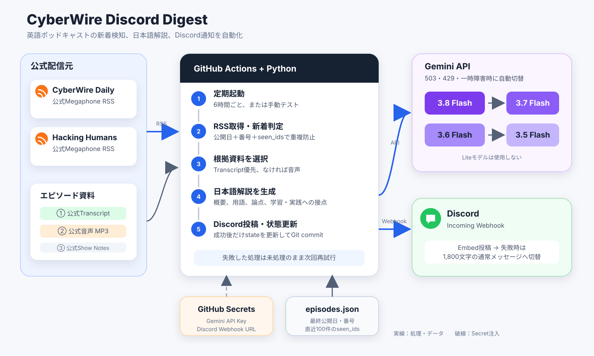

# CyberWire Discord Digest

CyberWire Daily と Hacking Humans の公式RSSを定期確認し、新しいエピソードだけをGeminiで日本語解説にしてDiscordへ投稿します。

## システム構成

[](docs/architecture.md)

処理フローと外部サービスの役割は[構成図の解説](docs/architecture.md)にまとめています。

## 動作

- 6時間ごと（UTCの `00:17`, `06:17`, `12:17`, `18:17`）にGitHub Actionsで実行
- 公式Transcriptがあれば最優先で利用
- TranscriptがなければRSSの公式音声をGeminiに渡す
- 音声処理に失敗した場合だけ公式Show Notesへフォールバック
- Discordにはタイトル、番組名、公開日、公式リンク、日本語解説、使用した根拠を投稿
- 投稿成功後にだけ `state/episodes.json` を更新し、同じ回の二重投稿を防止

初期基準は次のとおりです。これら以前の回は通常投稿されません。

- CyberWire Daily: Ep 2630（2026-09-04）
- Hacking Humans: Ep 401（2026-09-03）

## 初回設定

### 1. Gemini APIキーを取得

[Google AI Studio](https://aistudio.google.com/app/apikey) でAPIキーを作成します。このキーはチャット、Issue、ソースコードへ貼り付けないでください。

### 2. Discord Webhookを作成

投稿先チャンネルの「チャンネルの編集」→「連携サービス」→「ウェブフック」から新規Webhookを作り、Webhook URLをコピーします。

### 3. GitHub Secretsへ登録

このリポジトリの「Settings」→「Secrets and variables」→「Actions」→「New repository secret」で、次の2件を登録します。

| Secret名 | 値 |
|---|---|
| `GEMINI_API_KEY` | Google AI Studioで取得したAPIキー |
| `DISCORD_WEBHOOK_URL` | DiscordでコピーしたWebhook URL |

### 4. テスト投稿

GitHubの「Actions」→「Podcast Digest」→「Run workflow」を開き、`test_mode` をオンにして実行します。各番組の最新回をテスト投稿しますが、既読状態は変更しません。

テスト投稿を確認できたら設定完了です。以後は新しい回が見つかったときだけ自動投稿されます。

## ローカル実行

```bash
python -m venv .venv
source .venv/bin/activate
pip install -r requirements.txt
export GEMINI_API_KEY="..."
export DISCORD_WEBHOOK_URL="..."
python podcast_digest.py
```

最新回を既読状態を変えずに試す場合は `TEST_MODE=true` を追加します。

## 補足

- Geminiは `3.8 Flash` → `3.7 Flash` → `3.6 Flash` → `3.5 Flash` の順で利用します。高需要や一時的なAPI障害が起きた場合だけ次のモデルへ自動的に切り替わります。Liteモデルは使用しません。
- モデル順を変更する場合は `GEMINI_MODELS` 環境変数へカンマ区切りで指定します。安全のため、Flash以外またはLiteを含む指定はエラーになります。
- GitHub Actionsの定期実行は混雑時に遅れることがあります。
- 公開リポジトリでもGitHub Secretsの値はソースコードには保存されません。ただし、ログへキーを出力する変更は加えないでください。
- 無料枠やモデル提供条件は変更される可能性があるため、Google AI Studio側の利用状況も確認してください。
